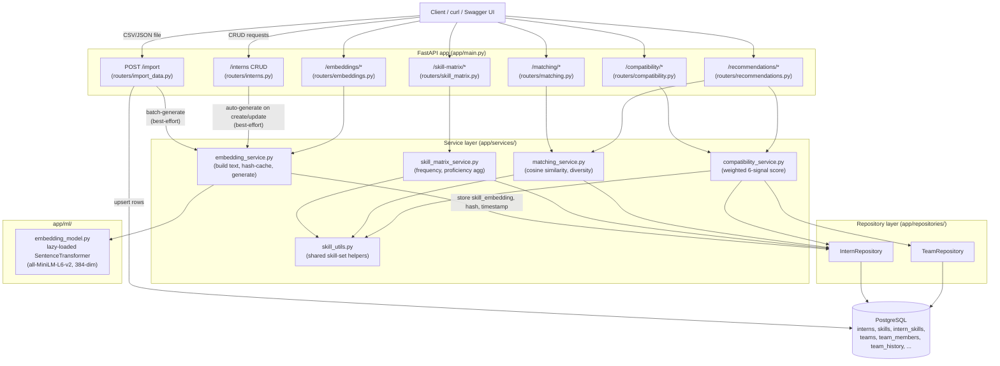
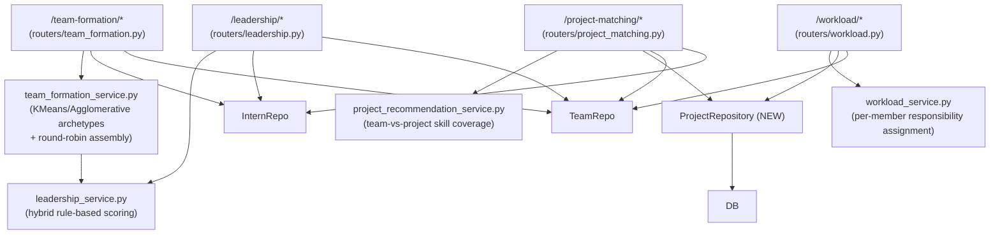
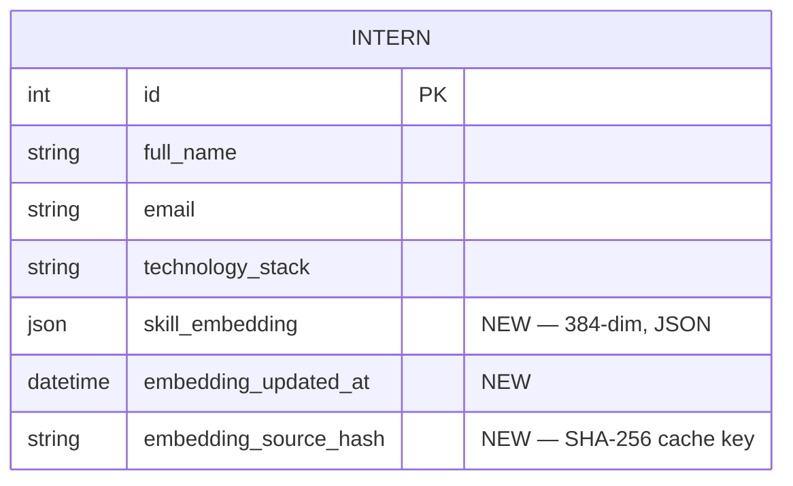
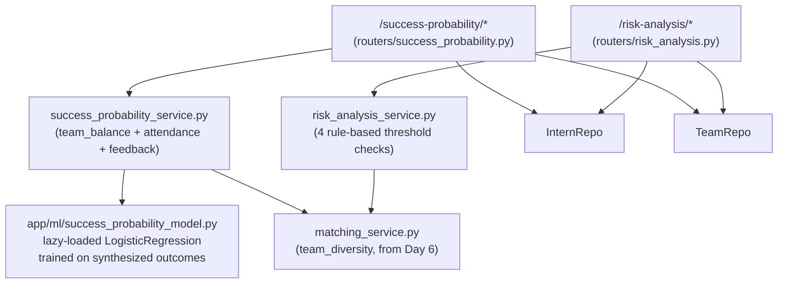
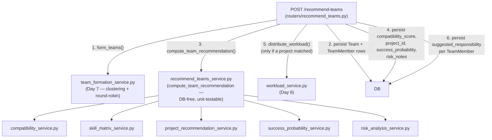
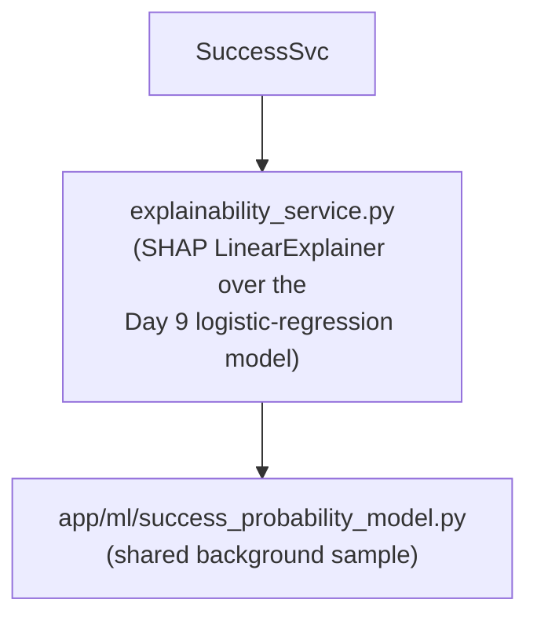
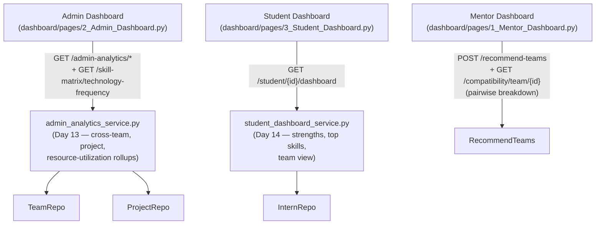
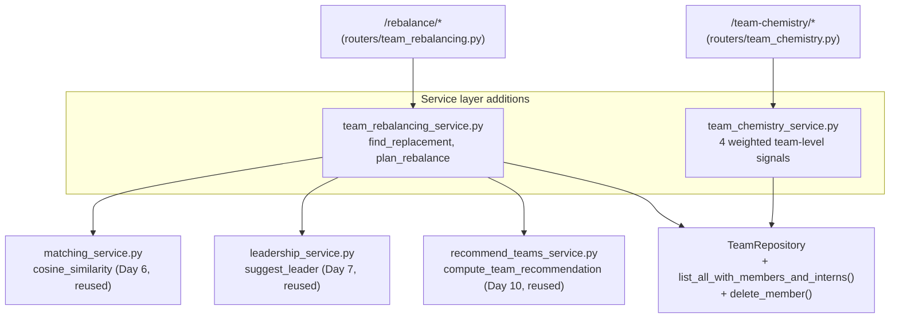
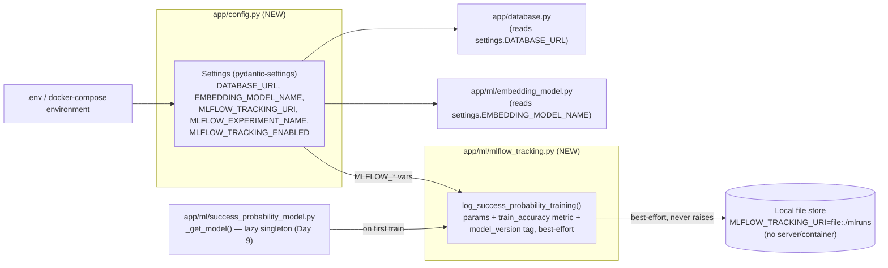
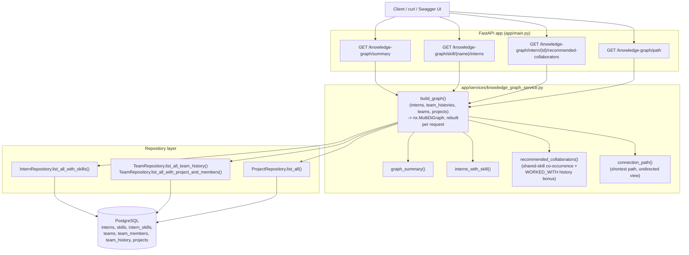

# Architecture Diagram v5 (Post-Day-20 gap-fix — Final)

System-level view as of the post-Day-20 QA pass, the final architecture
revision for this project. Version history: v1 was Day 5's Week 1
checkpoint (Import -> Embedding -> Skill Matrix); this file was extended
in place through Days 7-9 without a v2 heading (the Day 10 guide's
"update to v2" step folded straight into the running document below
rather than forking a second file); v3 was Day 15's "finalize the
diagram" pass, the first version showing the complete system end to end
through Checkpoint 2 (Day 10) and the three dashboards; v4 (Day 17) added
Day 16's two bonus engines and Day 17's config/observability layer
(`app/config.py`, MLflow); v5 below adds the Engineering Knowledge Graph
— a required AI Architecture component in the original case study PDF
that v1-v4 designed for (see the execution guide's Day-1 tech-choice
table) but never actually built, caught and fixed in a post-Day-20 QA
pass (see the new section at the end of this file).

## Request flow: Import → DB → Embedding → Skill Matrix → Matching/Compatibility

## Why this layering (Day 4-6 additions specifically)

- **Routers stay thin.** Every Day 4-6 router does auth-free request
  validation + calls one service function + maps the result to a Pydantic
  schema. No business logic lives in a router.
- **Services own the logic, repositories own the queries.** This split
  exists so `matching_service` and `compatibility_service` — which both need
  "all interns on this team" or "interns with a usable embedding" — share
  one query implementation (`InternRepository`) instead of three slightly
  different copies.
- **`skill_utils.py` is the single source of truth for "what skills does
  this intern have."** Both `InternSkill` (structured, Day 2 schema) and
  `Intern.technology_stack` (free text, the only thing `/import` populates)
  feed it — the Skill Matrix, Matching, and Compatibility engines all agree
  on this because they all call the same function, not three separate
  reimplementations that could drift.
- **`app/ml/` is isolated from everything else** so the heavy
  `sentence-transformers`/`torch` import only happens lazily, on first real
  use — not at process start, and not in test runs (tests monkeypatch
  `get_model` entirely, see `tests/conftest.py`).
- **Days 1-3 routers (`interns.py`, `projects.py`, `teams.py`,
  `import_data.py`) were extended, not replaced.** The only changes to
  existing files are: (1) the automatic-embedding hooks in `interns.py` and
  `import_data.py`, both wrapped so they can never turn a successful CRUD/
  import operation into a failure, and (2) `main.py` registering the 5 new
  routers alongside the original 4.

## Day 7-8 additions: Team Formation, Leadership, Project Matching, Workload

Same layering as Days 4-6 — thin routers, services own logic, repositories
own queries:

Notes specific to these four days:

- **`team_formation_service` calls `leadership_service` directly** — the
  only cross-service call introduced this round. Team formation needs a
  suggested leader per team it builds; leadership scoring is the module
  that already owns that logic, so it's reused rather than reimplemented
  inline.
- **`ProjectRepository` is new** (Day 8) — Days 1-3's `routers/projects.py`
  still talks to `models`/`db` directly for plain CRUD (same pattern as
  Day 1-3's other routers); the repository exists because
  `project_recommendation_service` needs to score a team against *every*
  project in one call, not fetch-one-at-a-time like the CRUD router does.
- **Every write path from these four days follows the GET-preview /
  POST-persist split** Day 6 established with `/compatibility/team/{id}/
  recalculate`: `/team-formation/preview` vs `/commit`,
  `/leadership/team/{id}/suggest` vs `/apply`, `/project-matching/team/{id}`
  vs `/assign`, `/workload/team/{id}` vs `/apply`. None of the read-only
  endpoints ever have a side effect.

## Data model — no changes in Days 7-8

Every field these four days write to (`Team.project_id`,
`TeamMember.role`, `TeamMember.suggested_responsibility`) was already
reserved in the Day 1 ERD. Team formation and project matching are the
first features to actually populate them programmatically instead of via
a manual `PUT`/`POST`.

Everything else — `Skill`, `InternSkill`, `Team`, `TeamMember`,
`TeamHistory`, `MentorFeedback`, `Attendance`, `Project` — is unchanged from
Day 1/2's schema. Day 6's Compatibility Score reads `Team.compatibility_score`
(already reserved for this in the Day 1 ERD) and writes to it only via the
explicit `POST /compatibility/team/{id}/recalculate` action.

## Day 9 additions: Success Probability, Risk Analysis

Notes specific to Day 9:

- **`success_probability_service` is ML (a lazily-trained scikit-learn
  model); `risk_analysis_service` is deliberately rule-based** — the spec
  calls for both approaches, and unlike every other engine so far there's
  no way to train a *real* model here yet (no historical "did this team
  succeed" outcome exists anywhere in the system). `app/ml/
  success_probability_model.py` is explicit about this: it trains on
  synthesized data with a documented prior, isolated in its own module
  (same lazy-singleton pattern as `app/ml/embedding_model.py`) so swapping
  in real outcome data later only touches that one file.
- **Both services reuse `matching_service.team_diversity`** rather than
  recomputing skill overlap — `team_balance` (Success Probability) and the
  `skill_overlap` risk check (Risk Analysis) are the same underlying
  0.0-1.0 diversity score read two different ways, so both call the one
  Day 6 function instead of each defining their own.
- **`risk_analysis_service` reads `Team.compatibility_score` but treats
  `0.0`/unset as "no signal", not "certainly high risk"** — same "absence
  of data isn't evidence" principle Day 6/7's neutral defaults use. A team
  that hasn't had `/compatibility/team/{id}/recalculate` run yet doesn't
  get flagged for high conflict likelihood just because the column
  defaults to zero.
- **No new repository classes** — Day 9 only adds one method,
  `InternRepository.feedback_for_interns()`, following the same "add
  what's needed, don't pre-build" approach as every prior day's
  repository layer.

## Day 10 additions: Checkpoint 2 — every engine wired together

`POST /recommend-teams` is the integration layer the spec asks for: form
teams from a candidate pool, then run every engine built on Days 4-9
against each formed team, persisting results the same way each engine's
own single-purpose endpoint would.

Notes specific to Day 10:

- **The router is deliberately not thin.** Every other router in this
  system is request-validate -> one service call -> map to schema; this
  one *is* the orchestration the spec asks for, so the sequencing lives
  here. The DB-free half (steps 3 above) is still pushed into
  `recommend_teams_service.compute_team_recommendation` so it stays
  testable without a live session — see `tests/test_recommend_teams_service.py`.
- **Workload only runs if a project matched.** A team with no project fit
  (empty `projects` table, or nothing clears the coverage bar) gets no
  `workload` rows — same "absence of data isn't evidence" pattern Day 9's
  risk analysis and Day 13's admin analytics both use for unscored teams.
- **`overall_score`** blends compatibility (35%), success probability
  (35%), project fit (20%), and skill diversity (10%) into one number for
  ranking/display — weights enforced to sum to 1.0 by
  `test_overall_score_weights_sum_to_one`.

## Day 11 additions: Explainable AI Layer

`success_probability_service.compute_success_probability` now calls
`explainability_service.explain_success_probability` alongside the model
prediction, attaching a SHAP-derived `explanation` (base value, per-feature
contributions, plain-English reasons, and a one-line summary) to every
response that carries a success probability — `/success-probability`
directly, and `/recommend-teams` via `recommend_teams_service`, per the
Architecture doc's own stated goal: "SHAP-based reasons attached to every
recommendation." No new persisted columns — the explanation is always
recomputed from the same three features (`team_balance`,
`avg_attendance_pct`, `avg_feedback_score`) that already feed the model,
never stored, so it can't go stale relative to whatever the model would
say right now.

## Days 12-14 additions: the three dashboards

No new backend engines in this span except Day 13's admin-analytics
rollups and Day 14's student-dashboard read model — both deliberately
thin, since their job is presenting what Days 1-11 already computed and
persisted, not computing anything new:

Notes specific to Days 12-14:

- **Mentor Dashboard computes nothing** — one call to `/recommend-teams`
  plus one supplementary call per team to the Day 6 pairwise-compatibility
  endpoint (kept separate rather than inlined into `/recommend-teams` to
  avoid an O(n²) pairs blob in every response).
- **Admin and Student both read persisted `Team` columns, not the live
  engine output** — `admin_analytics_service` and `student_dashboard_service`
  read `Team.compatibility_score` / `Team.success_probability` straight
  off the row `/recommend-teams` (or the Day 9 `/success-probability/
  .../recalculate`) last wrote. This is the one place in the system where
  a genuine cross-day bug surfaced at the Day 15 checkpoint — see below.
- **`lib/ui.py` (Day 14)** centralizes loading/error/empty-state rendering
  across all three pages — the only cross-page frontend refactor in this
  span; no backend equivalent was needed since the three dashboards don't
  share backend code beyond the repositories they already both used.

## Day 15 — Checkpoint 3: full-stack integration bug found and fixed

Running the complete chain end to end (`/import` -> `/recommend-teams` ->
`/admin-analytics/*` and `/student/{id}/dashboard`) surfaced a scale
mismatch that no single day's isolated unit tests caught, because each
day's tests were internally consistent with *that day's own* assumption
about the column:

- `Team.compatibility_score` is persisted **0-100** (see `app/models.py`).
- `Team.success_probability` is persisted **0-1**, deliberately, per the
  Day 1 ERD — both `POST /recommend-teams` (Day 10) and
  `POST /success-probability/team/{id}/recalculate` (Day 9) divide the
  engine's 0-100 output by 100 before writing it.
- Every endpoint that reports success probability to a client — the Day 9
  `/success-probability` response, the Day 10 `/recommend-teams` response,
  and the Mentor Dashboard that renders the latter directly — reads the
  **live engine output** (0-100) and never touches the persisted column,
  so the 0-1 storage convention stayed invisible.
- Day 13's `admin_analytics_service` and Day 14's `student_dashboard_service`
  were the first code to read the **persisted column** back out for
  display, and passed the raw 0-1 value straight through. Both dashboards
  format success probability as `f"{value:.0f}%"` — written against the
  0-100 convention every other screen already uses — so a team scoring a
  genuine ~72% would have rendered as **"1%"** on the Admin and Student
  Dashboards specifically (Mentor Dashboard was unaffected, since it never
  reads the column).
- Each day's own unit tests missed this because they set synthetic values
  like `team.success_probability = 70.0` directly on the column —
  internally consistent with what that day's assertions expected, but not
  with the real 0-1 range the column actually holds once real data flows
  through `/recommend-teams`.

**Fix:** `admin_analytics_service.py` now exposes
`SUCCESS_PROBABILITY_DB_TO_PCT = 100.0` and rescales at all three read
sites (`cross_team_analytics`'s per-team summaries and org-wide average,
`project_success_rates`'s per-project average); `student_dashboard_service.py`
imports the same constant for `build_team_view`. The two days' existing
unit tests that set the column directly were corrected to use a realistic
0-1 value (e.g. `0.70`) and assert the rescaled `70.0` output, matching
what `/recommend-teams` and `/success-probability` actually persist.
`tests/test_integration_day15_checkpoint.py` adds the full-chain
regression test that would have caught this directly: it asserts the
`success_probability` a `/recommend-teams` response returns for a team
matches what `/admin-analytics/teams` and `/student/{id}/dashboard`
report back for that same team, not just that each endpoint responds
with *some* number.

No other integration gaps found in this pass — the recommend-teams
response shape, the workload-persistence path, and all three dashboards'
field access were traced against `app/schemas.py` and found consistent.

## Day 16 additions: bonus features (Automatic Team Rebalancing, Team Chemistry)

Both reuse Day 1's ERD end to end — no new tables. Both are standalone
route groups (not folded into `/recommend-teams`), for the reasons
DAY16_GUIDE.md spells out (rebalancing is trigger-based, not part of
initial formation; chemistry needs to be callable against any existing
team, including ones formed before Day 16 shipped).

Deliberate reuse over new implementations: `find_replacement` reuses Day
6's `cosine_similarity` rather than a new similarity metric; a rebalanced
team is rescored via Day 10's exact `compute_team_recommendation`, so
compatibility/project-fit/success-probability/risk can't drift between a
freshly-formed team and a rebalanced one. Chemistry is recomputed live on
every call rather than persisted — same choice Day 11 made for
`explanation` — so it can't go stale relative to current membership or
the latest mentor feedback.

## Day 17 additions: config cleanup + MLflow model-version tracking

Both are cross-cutting — they don't add routes, so no new subgraph in the
request-flow diagrams above; they change how the *existing* pieces get
their configuration and how the one trained model in this system
(Day 9's `success_probability_model`) gets its training runs recorded.

**Config cleanup.** Before Day 17, `DATABASE_URL` and `EMBEDDING_MODEL_NAME`
were each read via a direct `os.getenv` call at their own point of use.
`pydantic-settings` had been sitting in `requirements.txt` since Day 1,
unused. One `Settings` object (`app/config.py`) is now the single source
of truth for every environment-driven value, including the two new
MLflow ones — same defaults as before for the pre-existing vars, so this
is a pure refactor, not a behavior change. `app/database.py` and
`app/ml/embedding_model.py` were updated to import `settings` instead of
calling `os.getenv` directly.

**MLflow tracking.** Scope is deliberately narrow: there is exactly one
trained model in this system. `app/ml/mlflow_tracking.py` wraps its one
training call (inside `success_probability_model._get_model()`) with an
MLflow run — params (random seed, sample size, feature names), a train-
accuracy metric, and a `model_version` tag (a short hash fingerprint of
the training params, so different training assumptions produce visibly
different versions without hand-bumping a version number).

`mlflow-skinny` (not the full `mlflow` package) intentionally — the
client API without a bundled tracking server/UI process — against a
local `file:./mlruns` store by default. This gets run history "for free"
with no new service in `docker-compose.yml`, no new port, nothing else to
keep healthy; pointing `MLFLOW_TRACKING_URI` at a real tracking server
later requires no application code changes. Tracking is best-effort by
construction — every failure path in `log_success_probability_training`
is caught and logged as a warning rather than raised, since a disk-full
or unwritable-volume tracking store must never turn a successful model
train into a 500 on the first `/success-probability` call. The test
suite disables tracking via an autouse `conftest.py` fixture (so the
suite never writes an `mlruns/` directory as a side effect);
`tests/test_mlflow_tracking.py` re-enables it locally against a
`tmp_path` to test the logging path itself, including that a broken
tracking backend still doesn't raise.

## Post-Day-20 gap-fix: Engineering Knowledge Graph

The case study PDF's "AI Architecture Requirements" section lists seven
components: Team Recommendation Engine, Skill Matching Engine,
Collaboration Prediction Model, **Engineering Knowledge Graph**,
Recommendation APIs, Explainable AI Layer, Performance Analytics Engine.
Six of the seven were built during Days 1-20; the Knowledge Graph was
designed (the execution guide's Day-1 tech-choice table picked NetworkX
in-process specifically to avoid a Neo4j server for a 4-week build) but
never actually implemented. A QA re-read against the original PDF (rather
than only the execution guide, which had quietly reclassified this item
as "optional/bonus") caught the gap, and it's now built exactly per that
original plan.

**Graph shape.** A `networkx.MultiDiGraph` with four node types (`intern`,
`skill`, `team`, `project`) and five edge relations:

- `intern --HAS_SKILL(proficiency)--> skill` — from `InternSkill` rows and
  `technology_stack` tokens (same union `skill_utils.py` already uses for
  Skill Matrix/Matching, so all three engines agree on "what skills does
  this intern have").
- `intern --WORKED_WITH(past_team_name, outcome_rating)--> intern` — added
  both directions between any two interns who share a `TeamHistory.
  past_team_name`, weighted by the average of their two outcome ratings.
- `intern --MEMBER_OF(role)--> team`, `team --ASSIGNED_TO--> project`,
  `project --REQUIRES--> skill` (parsed from `required_tech_stack`).

**Design decision: rebuilt per request, not persisted.** `build_graph()`
runs a handful of already-indexed queries and constructs the graph fresh
on every call rather than maintaining an incrementally-updated structure
in a separate store. For a dataset sized like this project's (hundreds of
interns, not tens of thousands), that's a few milliseconds of work and
means there's no second source of truth that can drift from the
relational data — the same reasoning that kept this an in-process library
instead of a standalone Neo4j server in the first place. At real-portal
scale this would need either a cached/incremental build or an actual
graph database; that tradeoff is called out in `README.md`'s Known
Limitations.

**Business value this closes.** The graph directly answers the case
study's own example questions in an inspectable way — `GET
/knowledge-graph/skill/Laravel/interns` answers "which Laravel developers
should work together?" at the candidate-finding step, and `GET
/knowledge-graph/intern/{id}/recommended-collaborators` ranks candidates
by shared skills plus past-collaboration outcome, returning the *evidence*
(shared skill names, past team name, past outcome rating) alongside every
score rather than an opaque number — which is also why this engine
reinforces the Explainability criterion, not just Architecture.
