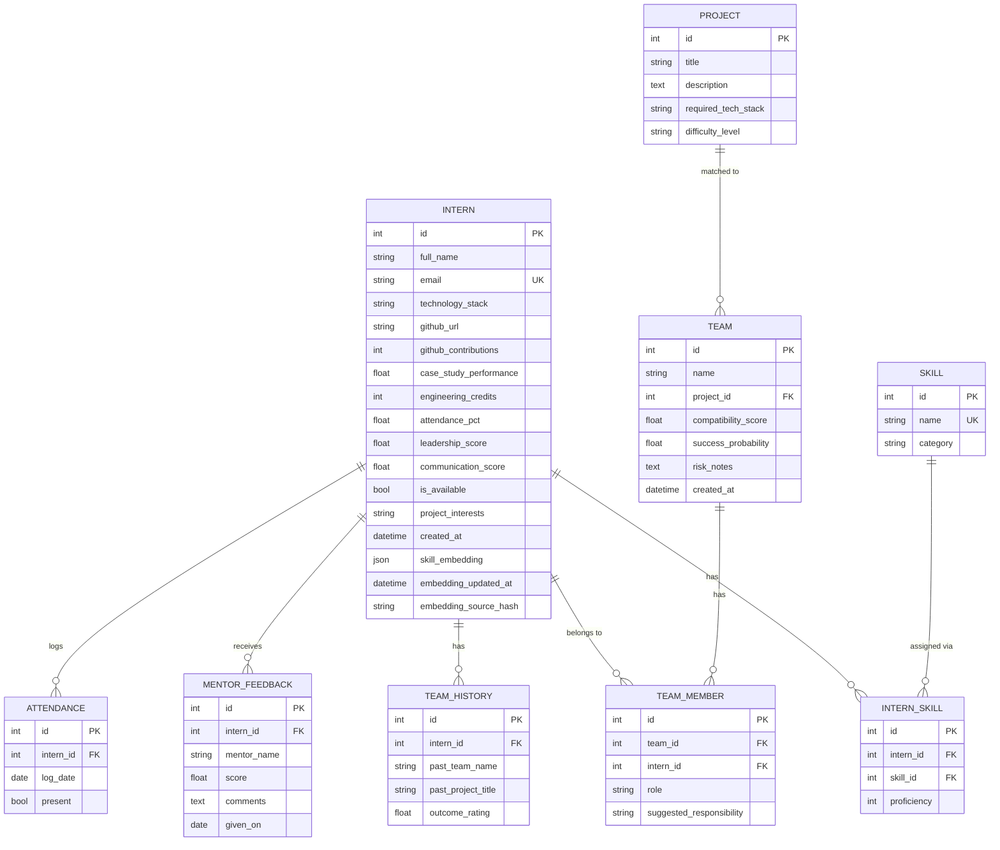

# Database Design

Written Day 17, against the schema as it stands after Day 16 — no tables
were added Days 16-17 (both bonus features and the Day 17 MLflow/config
work reuse the existing schema and a local file store respectively), so
this documents the same nine tables `app/models.py` has held since the
Day 2 Alembic migrations, with the columns later days actually put to use.

## Engine

PostgreSQL 16 in production/dev (via `docker-compose.yml`); SQLite
in-memory in the test suite (`tests/conftest.py`). The one column this
constrains is `Intern.skill_embedding` (see below) — a generic
SQLAlchemy `JSON` type instead of a Postgres-only `ARRAY`/`pgvector`
column, specifically so both backends can store it.

## Entity-Relationship Diagram

## Tables

### `interns`

The central entity — one row per intern, holding both raw profile data
and every AI engine's derived output on that intern.

| Column | Type | Notes |
|---|---|---|
| `id` | PK int | |
| `full_name`, `email` | string | `email` is unique + indexed |
| `technology_stack` | string | Comma-separated (MVP, not normalized). The only field `/import` populates directly; feeds `skill_utils.py` alongside the structured `intern_skills` join table. |
| `github_url`, `github_contributions` | string / int | Refreshed periodically outside the request cycle |
| `case_study_performance`, `engineering_credits` | float / int | Static profile signals |
| `attendance_pct` | float | Rolling aggregate — daily detail lives in `attendance` |
| `leadership_score`, `communication_score` | float (0-10) | `leadership_score` drives Day 7's leader suggestion and Day 16's chemistry `leadership_balance` signal; `communication_score` drives Day 16's `communication_spread` signal |
| `is_available` | bool | Day 16's `GET /rebalance/needed` flags any team with a member where this is `False` |
| `project_interests` | string | Comma-separated. Existed since Day 1 but was, until Day 16, only ever folded into the Day 4 embedding text — Day 16's chemistry `shared_interests` signal is the first code to read it as a discrete field |
| `skill_embedding` | JSON | 384-dim vector (Day 4, `all-MiniLM-L6-v2`). Generic `JSON` rather than a Postgres `ARRAY`/`pgvector` column so SQLite-backed tests work without a running Postgres instance |
| `embedding_updated_at`, `embedding_source_hash` | datetime / string | `embedding_source_hash` is a SHA-256 of the text last embedded, so re-embedding is skipped when nothing relevant (skills/tech stack/interests) actually changed |

### `skills` / `intern_skills`

Normalized skill catalog and a many-to-many join (`UniqueConstraint` on
`(intern_id, skill_id)`) carrying a 1-5 `proficiency` rating. This is the
*structured* half of "what skills does this intern have" — `skill_utils.py`
merges it with `technology_stack`'s free text so the Skill Matrix,
Matching, and Compatibility engines all agree on one answer rather than
maintaining three slightly different reimplementations.

### `projects`

Candidate projects a team can be matched against (`required_tech_stack`,
`difficulty_level`). One-to-many with `teams` — a project can have
multiple teams pursuing it (or none, if a team hasn't been matched yet).

### `teams` / `team_members`

`teams.project_id` is nullable — a team can exist before (or instead of)
being matched to a project. `compatibility_score` (0-100) and
`success_probability` (0-1) are both *persisted engine outputs*, not raw
inputs — see the Day 15 checkpoint note in `ARCHITECTURE.md` for the
scale mismatch this asymmetry caused and how it was fixed.
`team_members` is the many-to-many join (`UniqueConstraint` on
`(team_id, intern_id)`) carrying `role` ("Lead"/"Member") and
`suggested_responsibility` (Day 8's workload output). Day 16's
rebalancing deletes and re-inserts rows here directly
(`team_repository.delete_member`) rather than mutating in place, so a
membership swap is an atomic delete+insert, not a partial update that
could leave `role`/`suggested_responsibility` in an inconsistent state.

### `team_history`

Per-intern record of past teams/projects and an outcome rating —
designed as a future input signal for team formation, not yet consumed
by any engine as of Day 17 (no engine reads it back out; it's populated
for forward-compatibility, per the original Day 1 ERD).

### `mentor_feedback`

`score` (0-10) feeds Day 9's `success_probability_model` synthetic
training signal. `comments` (free text) existed since Day 1 but was
never read by any engine until Day 16's chemistry `feedback_sentiment`
signal — a small, transparent keyword scan, not a trained sentiment
model, for the same "no labeled training data exists for this" reason
Day 9's model docstring gives for its own synthetic-data choice.

### `attendance`

Daily present/absent log per intern; `interns.attendance_pct` is the
rolling aggregate derived from this table (populated by the seed script,
not recomputed live from `attendance` rows in the current implementation).

## Design decisions worth calling out

- **No `pgvector`.** `skill_embedding` is a generic `JSON` column specifically
  so the same schema runs against both Postgres (prod/dev) and SQLite
  (tests) without conditional model definitions. Cosine similarity is
  computed in Python (`matching_service.cosine_similarity`), not pushed
  down to the database — acceptable at this dataset's scale (~100s of
  interns), and it keeps the schema portable.
- **Free-text over normalized tables for `technology_stack` and
  `project_interests`.** Both are comma-separated strings rather than
  their own join tables, an explicit MVP tradeoff noted inline in
  `app/models.py`. `skill_utils.py` centralizes parsing so this tradeoff
  is invisible to every engine that reads skill data.
- **Two different persisted scales in `teams`** (`compatibility_score`
  0-100, `success_probability` 0-1) is a real inconsistency in the
  original Day 1 ERD, kept as-is rather than migrated, with the
  read-side rescaling fix from the Day 15 checkpoint documented in
  `ARCHITECTURE.md` rather than papered over here.
- **No schema changes for Day 16's two bonus features.** Both
  Rebalancing and Team Chemistry are pure read/recompute logic over the
  existing `interns`/`teams`/`team_members`/`mentor_feedback` tables —
  the clearest sign the original Day 1 ERD anticipated the right shape
  of data even before the engines that would eventually consume every
  column existed.
