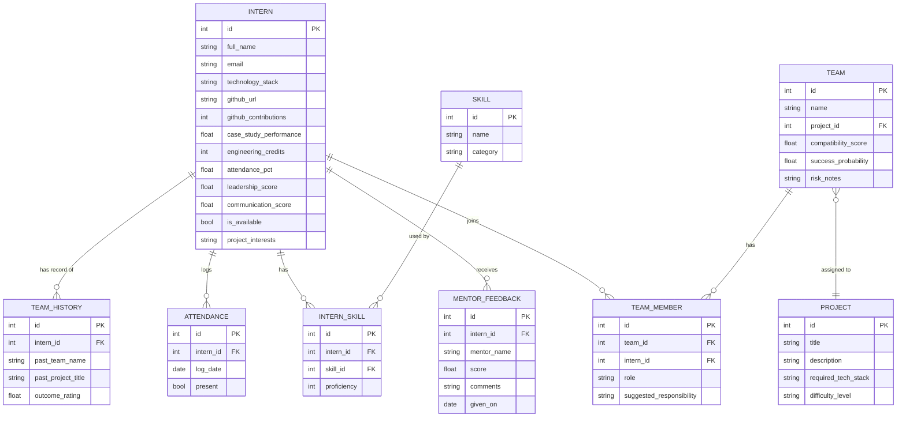

# Day 1 — Kickoff & Environment: Full Walkthrough

Goal for today: **repo initialized, Docker environment running, ERD draft committed.**
Everything below assumes zero setup so far.

---

## 0. Prerequisites (install once, before Day 1 starts)

- Python 3.11+ — `python3 --version`
- Docker Desktop (includes Docker Compose) — `docker --version` and `docker compose version`
- Git — `git --version`
- A code editor (VS Code recommended, with the Python + Docker extensions)
- A GitHub account / empty repo created for this project

If any of these are missing, install them first — nothing else in this guide works without Docker running.

---

## 1. Create the repo and folder structure (15 min)

```bash
mkdir ezitech-ai020 && cd ezitech-ai020
git init
mkdir app
```

Target structure by end of today:

```
ezitech-ai020/
├── app/
│   ├── __init__.py
│   ├── main.py         # FastAPI skeleton
│   ├── database.py      # SQLAlchemy engine/session
│   └── models.py        # ERD as SQLAlchemy models
├── Dockerfile
├── docker-compose.yml
├── requirements.txt
├── .env.example
├── .gitignore
└── README.md
```

## 2. (Optional but recommended) Local virtual environment for IDE support

Docker will run the real app, but a local venv gives you autocomplete/type-checking in your editor:

```bash
python3 -m venv venv
source venv/bin/activate        # Windows: venv\Scripts\activate
pip install -r requirements.txt
```

## 3. Add `requirements.txt`

Keep it minimal today — just enough for a FastAPI + Postgres skeleton. (ML libraries get added in Week 2.)

`fastapi`, `uvicorn[standard]`, `sqlalchemy`, `psycopg2-binary`, `alembic`, `python-dotenv`, `pydantic-settings`

## 4. Write the `Dockerfile`

Base image `python:3.11-slim`, copy `requirements.txt`, install, copy `app/`, run `uvicorn` with `--reload` so code changes reflect instantly during development.

## 5. Write `docker-compose.yml`

Two services:
- **db** — `postgres:16`, reads credentials from `.env`, has a healthcheck (`pg_isready`) so the backend doesn't start before Postgres is ready to accept connections, persists data in a named volume so you don't lose your seed data every restart.
- **backend** — builds from your `Dockerfile`, waits on `db` being healthy, mounts `./app` as a volume so `--reload` picks up your edits live, exposes port 8000.

## 6. Set up environment variables

```bash
cp .env.example .env
```

Never commit `.env` itself — only `.env.example` (already in `.gitignore`).

## 7. Write the FastAPI skeleton (`app/main.py`)

Minimum viable skeleton for today:
- App instance with title/description/version
- CORS middleware (wide open for now, tighten later)
- `GET /` — basic liveness
- `GET /health` — actually runs `SELECT 1` against Postgres, so you can prove both containers are talking to each other, not just that the API process is alive

## 8. Set up the database connection (`app/database.py`)

Standard SQLAlchemy pattern: `engine`, `SessionLocal`, `Base`, and a `get_db()` FastAPI dependency that yields a session and always closes it. Reads `DATABASE_URL` from the environment so the same code works in Docker and locally.

## 9. Design and implement the ERD (`app/models.py`)

This is the actual thinking-heavy part of Day 1. The functional requirements list (skills, tech stack, GitHub, case-study performance, credits, attendance, mentor feedback, leadership, communication, previous team history, availability, project interests) maps to these entities:



Design notes for whoever reviews this later:
- `InternSkill` and `TeamMember` are junction tables (many-to-many) — this is what lets one intern have many skills at different proficiency levels, and lets the Team Formation Engine query "who knows React at level 4+".
- `attendance_pct` lives directly on `Intern` as a fast-access rolling aggregate; the `Attendance` table underneath keeps the daily detail in case you want trend-based features later (e.g. "attendance dropped in the last 2 weeks").
- `project_interests` and `required_tech_stack` are simple comma-separated strings for the MVP — fine for a 4-week build. If you have spare time in Week 4, normalizing these into their own tables is a clean upgrade, not a rewrite.
- This schema is a **draft**. Week 2's AI engines will very likely want 1–2 more fields (e.g. a numeric `case_study_performance` breakdown per category). That's expected — don't over-design today, just get something real running.

## 10. Bring the stack up and verify it

```bash
docker compose up --build
```

Then, in a browser or with curl:

```bash
curl http://localhost:8000/            # {"service": "...", "status": "running"}
curl http://localhost:8000/health      # {"api": "ok", "database": "ok"}
```

Open `http://localhost:8000/docs` — you should see the auto-generated Swagger UI (empty for now, but it proves FastAPI is wired up correctly). This Swagger page is also a Week 3 deliverable, so getting it running today isn't wasted effort.

If `/health` fails with a DB connection error: check that `db` shows `healthy` with `docker compose ps`, and that `DATABASE_URL` in `.env` matches the service name `db` (not `localhost`) — inside Docker, containers reach each other by service name.

## 11. Commit

```bash
git add .
git commit -m "Day 1: FastAPI + Postgres skeleton, Docker Compose, ERD draft"
git remote add origin <your-repo-url>
git push -u origin main
```

## 12. End-of-day checklist

- [ ] `docker compose up --build` starts both containers with no errors
- [ ] `/health` returns `{"api": "ok", "database": "ok"}`
- [ ] `/docs` loads the Swagger UI
- [ ] `app/models.py` defines all 8 entities above and imports cleanly
- [ ] ERD diagram (the mermaid block above, or a draw.io export of it) is committed
- [ ] `.env` is in `.gitignore`; `.env.example` is committed instead
- [ ] First commit pushed to GitHub

If all boxes are checked, you're exactly on schedule for Day 2 (turning this draft schema into real Alembic migrations + seed data).
