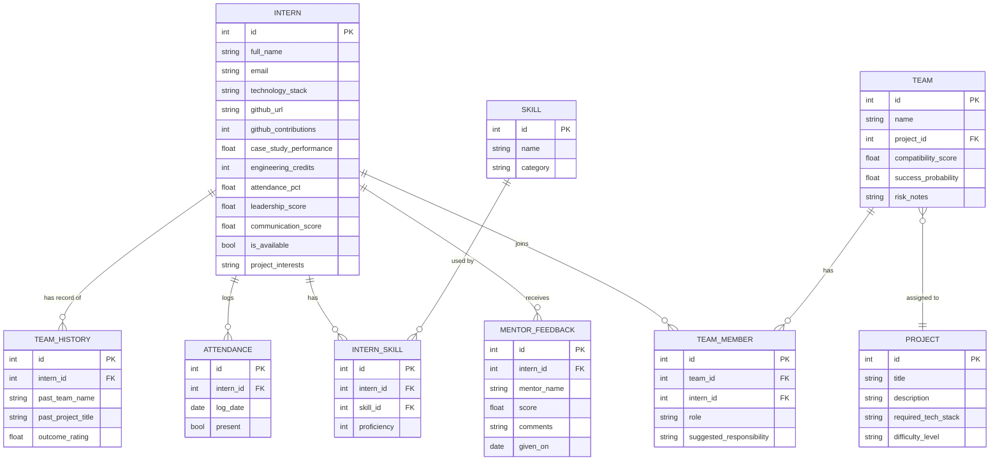

# Ezitech AI-020: Team Formation & Project Allocation Engine

An AI-assisted backend that takes a pool of interns and projects and
produces balanced, compatible, project-matched teams — end to end, from
CSV import through a trained success-probability model to an explainable
score breakdown — plus role-based dashboards (Mentor / Admin / Student)
on top of it.

**Live demo:** see [DEPLOYMENT_GUIDE.md](DEPLOYMENT_GUIDE.md#7-hosted-demo-day-18)
for standing up a hosted instance (Render/Railway/Fly.io, free tier) —
paste the deployed URL here once one is live. **API docs:** `/docs`
(Swagger) once the stack is running, or see
[API_DOCUMENTATION.md](API_DOCUMENTATION.md) for an annotated tour
organized by engine.

## Features

- **CSV/JSON import** of intern rosters with upsert semantics (Day 3)
- **Semantic skill embeddings** (sentence-transformers) + a Skill Matrix
  view of team/org-wide skill coverage (Day 4)
- **Compatibility scoring** — a 6-signal weighted pairwise/team score
  (skill similarity, availability, schedule overlap, communication,
  leadership balance, project-interest overlap) (Day 6)
- **Automatic team formation** via clustering (KMeans/Agglomerative) into
  skill-diverse, balanced teams, with leadership auto-suggestion (Day 7)
- **Project recommendation + workload distribution** — ranks candidate
  projects per team and suggests per-member responsibilities (Day 8)
- **Trained success-probability model** (scikit-learn `LogisticRegression`)
  plus rule-based risk-flag analysis (Day 9)
- **One-call team recommendation** (`POST /recommend-teams`) that chains
  every engine above end to end (Day 10)
- **Explainable AI layer** — SHAP-based per-feature contribution
  breakdown alongside every success-probability score, so "why" is never
  a black box (Day 11)
- **Mentor / Admin / Student dashboards** (Streamlit) with cross-team
  analytics, project success rates, and resource-utilization views
  (Days 11-14); re-themed post-Day-20 with a shared design system
  matching `presentation/AI-020_Technical_Presentation.pptx`, plus two
  new panels surfacing the Knowledge Graph (Admin's Skill Network,
  Student's "People to work with next") — see `dashboard/lib/theme.py`
- **Automatic team rebalancing** — detects teams with unavailable
  members and finds/applies best-fit replacements (Day 16, bonus)
- **Team chemistry prediction** — a team-level interpersonal-friction
  signal distinct from compatibility/success-probability (Day 16, bonus)
- **Lightweight MLflow model-version tracking** on the trained model,
  no separate tracking server required (Day 17)
- **Engineering Knowledge Graph** — an in-process NetworkX graph over
  interns/skills/teams/projects, with skill-neighbor lookup, graph-native
  collaborator recommendations, and explainable connection paths
  (post-Day-20 gap-fix — see "Known limitations" below)

## Tech stack

| Layer | Choice |
|---|---|
| API | FastAPI + Uvicorn |
| Database | PostgreSQL (SQLAlchemy ORM + Alembic migrations) |
| ML — embeddings | sentence-transformers (`all-MiniLM-L6-v2`) |
| ML — clustering | scikit-learn (KMeans / Agglomerative) |
| ML — prediction | scikit-learn `LogisticRegression` |
| ML — explainability | SHAP |
| ML tracking | MLflow (`mlflow-skinny`, local file store) |
| Knowledge graph | NetworkX (in-process, no server) |
| Dashboards | Streamlit |
| Config | pydantic-settings |
| Testing | pytest + httpx, in-memory SQLite |
| Containerization | Docker + Docker Compose |
| Synthetic data | Faker |

## Quick start

```bash
git clone <this repo> && cd ezitech-ai020
cp .env.example .env
docker compose up --build -d
docker compose exec backend alembic upgrade head
docker compose exec backend python scripts/generate_mock_data.py   # or generate_demo_dataset.py for a small curated set
```

Then visit `http://localhost:8000/docs` (API) or
`http://localhost:8501` (dashboards). Full walkthrough, troubleshooting,
and hosted-deployment instructions: [DEPLOYMENT_GUIDE.md](DEPLOYMENT_GUIDE.md).

## Known limitations

- **Success-probability model is trained on synthetic (Faker-generated)
  historical outcomes, not real cohort data.** Its scores are internally
  consistent and its SHAP explanations are exact for what the model
  learned, but before trusting the numbers on a real cohort, retrain it on
  real historical team outcomes.
- **Skill embeddings need the `all-MiniLM-L6-v2` weights downloaded on
  first run** (~80MB, `sentence-transformers`, requires outbound internet
  the first time only — cached after). The test suite avoids this via a
  deterministic fake embedding model (see `tests/conftest.py`); there is
  no built-in offline fallback for production use.
- **`/recommend-teams` reclusters the entire candidate pool on every
  call.** It does not know about or preserve any previously hand-curated
  team groupings — if you need two specific teams to survive a
  re-recommendation, create/edit them directly via `POST /teams` +
  `POST /teams/{id}/members` instead of relying on clustering to
  reproduce them (see `DEMO_SCRIPT.md` for a worked example).
- **`/recommend-teams`'s default candidate pool excludes unavailable
  interns outright** (`list_available_unassigned_with_embeddings`) —
  confirmed by a live run. Marking someone `is_available=False` does
  *not* by itself get them onto a team or make them show up in
  `GET /rebalance/needed`; either pass their ID explicitly via the
  request's `intern_ids` override, or add them to an existing team via
  `POST /teams/{id}/members`, before rebalancing has anything to act on.
- **No authentication/authorization layer.** Every endpoint is open, per
  the case study's MVP scope — this includes the Student Dashboard's
  intern-ID lookup, which will show anyone's team/scores/strengths to
  anyone who enters their ID. A real deployment beyond a graded demo
  would need to add one before handling real intern data.
- **The dashboard's post-Day-20 re-theme (`dashboard/lib/theme.py`) is
  still unrendered in a real browser.** A later live-verification pass
  (see `FINAL_DELIVERABLES_CHECKLIST.md`) confirmed the *backend* end to
  end against a real running server, but `streamlit` itself still wasn't
  installed in that pass either (disk-constrained), so this specific
  limitation is unchanged: the injected CSS was verified by rendering
  the raw HTML/CSS string and unit-testing the network-graph layout math
  in isolation, not by opening the app. Click through all three
  dashboard pages once via `docker compose up` before presenting — every
  selector targets documented Streamlit 1.38 DOM hooks (the pinned
  version), but that's still "very likely correct," not "confirmed."
- **Redis caching is not implemented.** It was an explicitly optional
  infrastructure item in the technology-choice table (see
  `AI-020_Execution_Guide.docx`, Section 2) — not required for a working
  MVP, and not revisited since nothing in the current demo is slow enough
  to need it.
- **The Engineering Knowledge Graph is in-process NetworkX, not Neo4j.**
  The case study's suggested-technologies table names Neo4j, but the
  execution guide's own Day-1 tech choice picked NetworkX specifically to
  avoid a separate graph-server dependency for a 4-week build ("upgrade to
  Neo4j only if time remains"). That graph was designed but never actually
  implemented during Days 1-20; it was added in a post-Day-20 gap-fix pass
  (`app/services/knowledge_graph_service.py`, `/knowledge-graph/*`
  endpoints) once that gap was caught in QA. Not persisted — it's rebuilt
  from a DB query on every call, which is fine at this dataset size but
  would need caching or a real graph store at real-portal scale.
- **MLflow tracking is lightweight and local-file-store only** (Day 17)
  — no tracking server/UI process. Point `MLFLOW_TRACKING_URI` at a real
  server if one is ever stood up; nothing else in the app needs to
  change.
- **Not load-tested.** The stack has not been exercised under concurrent
  load; `docker-compose.yml`'s independently-scalable services and the
  async FastAPI backend are a documented scaling *path* (see
  `ARCHITECTURE.md`), not a benchmarked result.

## Project status (updated end of Day 20 / Week 4 — final)

| Day | Deliverable | Status | Guide |
|---|---|---|---|
| 1 | FastAPI + Postgres skeleton, Docker Compose, ERD draft | ✅ | this file |
| 2 | Alembic migrations, Faker seed data (120 interns) | ✅ | [DAY2_GUIDE.md](DAY2_GUIDE.md) |
| 3 | CRUD for interns/projects/teams + `/import` (CSV/JSON upsert) | ✅ | [DAY3_GUIDE.md](DAY3_GUIDE.md) |
| 4 | Sentence-Transformers embedding pipeline + Skill Matrix | ✅ | [DAY4_GUIDE.md](DAY4_GUIDE.md) |
| 5 | Checkpoint 1 — Import→DB→Embedding→Skill Matrix integration | ✅ | [DAY5_GUIDE.md](DAY5_GUIDE.md) |
| 6 | Skill Matching Engine (cosine similarity) + Compatibility Score | ✅ | [DAY6_GUIDE.md](DAY6_GUIDE.md) |
| 7 | Team Formation Engine (KMeans/Agglomerative) + Leadership Detection | ✅ | [DAY7_GUIDE.md](DAY7_GUIDE.md) |
| 8 | Project Recommendation Engine + Workload Distribution | ✅ | [DAY8_GUIDE.md](DAY8_GUIDE.md) |
| 9 | Success Probability model (scikit-learn) + Risk Analysis | ✅ | [DAY9_GUIDE.md](DAY9_GUIDE.md) |
| 10 | Checkpoint 2 — `/recommend-teams` (all engines wired together) | ✅ | this file |
| 11 | Explainable AI Layer (SHAP) + Dashboard scaffold | ✅ | [DAY11_GUIDE.md](DAY11_GUIDE.md) |
| 12 | API Finalization + Mentor Dashboard | ✅ | [DAY12_GUIDE.md](DAY12_GUIDE.md) |
| 13 | Admin analytics endpoints + Admin Dashboard | ✅ | [DAY13_GUIDE.md](DAY13_GUIDE.md) |
| 14 | Student Dashboard endpoint + frontend, UI unification | ✅ | [DAY14_GUIDE.md](DAY14_GUIDE.md) |
| 15 | Checkpoint 3 — full-stack integration bug found and fixed | ✅ | [DAY15_GUIDE.md](DAY15_GUIDE.md) |
| 16 | Bonus Features — Automatic Team Rebalancing + Team Chemistry Prediction | ✅ | [DAY16_GUIDE.md](DAY16_GUIDE.md) |
| 17 | Containerization finalized + MLflow tracking + Database Design / Deployment docs | ✅ | [DAY17_GUIDE.md](DAY17_GUIDE.md) |
| 18 | API Documentation + polished README + hosted-demo deployment config | ✅ | [DAY18_GUIDE.md](DAY18_GUIDE.md) |
| 19 | Technical presentation deck + live demo script (drafted, code-verified; live rehearsal against a running Docker instance still pending — see [DAY19_GUIDE.md](DAY19_GUIDE.md)) | ⚠️ Partial | [DAY19_GUIDE.md](DAY19_GUIDE.md) |
| 20 | Final QA pass (one real bug found & fixed in the explainability service) + deliverables checklist — 9/10 items complete; live demo rehearsal (item 9) still requires a real Docker run, see [FINAL_DELIVERABLES_CHECKLIST.md](FINAL_DELIVERABLES_CHECKLIST.md) | ⚠️ Partial | [DAY20_GUIDE.md](DAY20_GUIDE.md) |

See [API_DOCUMENTATION.md](API_DOCUMENTATION.md) for an annotated,
engine-by-engine tour of every endpoint (companion to the auto-generated
Swagger UI at `/docs`).

See [DATABASE_DESIGN.md](DATABASE_DESIGN.md) for the full ERD and
per-table column reference, and [DEPLOYMENT_GUIDE.md](DEPLOYMENT_GUIDE.md)
for bringing the stack up from scratch (env config, migrations, seeding,
verification, and troubleshooting).

See [ARCHITECTURE.md](ARCHITECTURE.md) for the architecture diagram
(request flow + service/repository layering, updated through Day 17 — v4,
the final revision; Day 18 adds no new layers or routes, only docs and
deployment config — see [DAY18_GUIDE.md](DAY18_GUIDE.md)). Day 10 adds
no new layers, just a router + service that composes the existing ones;
Day 11 adds one new service, `explainability_service`, plus the separate
`dashboard/` Streamlit app; Day 12 adds no new backend layers, just
schema/error-handling hardening and the first fully-built dashboard
page; Day 13 adds one new service, `admin_analytics_service`, plus its
`admin-analytics` router; Day 14 adds one new service,
`student_dashboard_service`, plus its `student-dashboard` router; Day 16
adds two bonus-feature services (`team_rebalancing_service`,
`team_chemistry_service`) plus their routers; Day 17 adds no new
routes — a centralized `app/config.py` and lightweight MLflow
model-version tracking on the Day 9 model.

Full endpoint list is in Swagger at `/docs` once the stack is running — 21
route groups as of Day 16 (19 through Day 14, +2 for Day 16's `rebalance`
and `team-chemistry`; Days 17-18 add no new routes — config/observability
and docs/deployment work respectively):
`interns`, `projects`, `teams`, `import` (Days 1-3);
`embeddings`, `skill-matrix`, `matching`, `compatibility`,
`recommendations` (Days 4-6); `leadership`, `team-formation` (Day 7);
`project-matching`, `workload` (Day 8); `success-probability`,
`risk-analysis` (Day 9); `recommend-teams` (Day 10); `admin-analytics`
(Day 13); `student-dashboard` (Day 14); `rebalance`, `team-chemistry`
(Day 16). `success-probability`'s two
endpoints and `recommend-teams` also return an `explanation` field
(Day 11).

### Day 12 — API Finalization + Mentor Dashboard

**API Finalization:** an audit pass over every router for consistency —
fixed two endpoints that were returning `404` for "exists but isn't ready"
states (`workload` with no members, `embeddings` with no embedding yet)
where every other engine already used `409`; tightened loose `str` fields
in `schemas.py` into proper `Literal` enums (`algorithm`,
`difficulty_level`, `role`, `source_format`, `direction`, `severity`); and
added `openapi_tags` metadata so `/docs` describes all 17 route groups
instead of just listing endpoints.

**Mentor Dashboard** (`dashboard/pages/1_🧑‍🏫_Mentor_Dashboard.py`): the
first fully-built dashboard page, replacing the Day 11 skeleton. Lets a
mentor pick a candidate pool (or use the default), calls
`POST /recommend-teams`, and renders each team's:

- **Recommended Teams** — members, suggested leader, roles
- **Team Balance Analysis** — skill matrix as a bar chart, diversity score
- **Collaboration Score** — team average plus the Day 6 pairwise
  breakdown (fetched from `/compatibility/team/{id}`), with the weakest
  pair called out
- **Recommended project + workload** — coverage, matched/missing skills,
  per-member responsibilities
- **Suggested changes** — Day 9's risk flags plus Day 11's SHAP-based
  explanation reasons, in plain language

Run it the same way as Day 11 (`docker compose up`, or
`cd dashboard && streamlit run Home.py`). Verified end-to-end against a
live backend using Streamlit's `AppTest` framework — boot the real API,
seed real interns/projects, drive the actual page (including form
submission) programmatically, confirm zero exceptions and correct
rendering — not just a code read-through.

### Day 13 — Admin Dashboard

**`admin-analytics` router** (`app/services/admin_analytics_service.py` +
`app/routers/admin_analytics.py`) — three read-only rollup endpoints,
built for the Admin Dashboard rather than any single team/intern lookup:

- `GET /admin-analytics/teams` — cross-team analytics: team-size
  distribution, average compatibility/success scores (**scored teams
  only** — a team created via plain CRUD defaults both to `0.0` and would
  otherwise drag every org-wide average toward zero), project-assignment
  and risk-assessment counts, plus a per-team summary table.
- `GET /admin-analytics/projects` — project success rates: how many teams
  have been matched to each project and their average success
  probability/compatibility, including projects with zero teams matched.
- `GET /admin-analytics/resource-utilization` — org-wide intern headcount:
  assigned vs. still-available candidate pool, embedding coverage, and
  attendance/case-study/credit averages.

Technology distribution — the fourth metric the execution guide calls out
for today — isn't a new endpoint; it's Day 4's existing
`GET /skill-matrix/technology-frequency` called with no `team_id` (already
org-wide). The Admin Dashboard calls it directly rather than duplicating
the aggregation, the same reuse the Mentor Dashboard made on Day 12 with
`/compatibility/team/{id}`.

**Admin Dashboard** (`dashboard/pages/2_🛠️_Admin_Dashboard.py`) replaces
the Day 11 preview with the real thing: all four metrics above, rendered
with Plotly bar/pie charts (team-size histogram, project-assignment and
team-assignment pie charts, top-20 technologies, per-project team counts
colored by success probability, org-wide score averages) plus full data
tables underneath each chart.

### Day 14 — Student Dashboard + UI Polish

**`student-dashboard` router** (`app/services/student_dashboard_service.py`
+ `app/routers/student_dashboard.py`) — one read-only endpoint,
`GET /student/{intern_id}/dashboard`, assembling everything a student
needs to see about themselves in a single call instead of the dashboard
stitching together `/interns/{id}`, `/teams/{id}`, and
`/workload/team/{id}` itself:

- **Assigned team + role** — read straight from the `TeamMember` row
  (`team_memberships[0]` — the same "one team per intern" assumption every
  other engine in this system already makes).
- **Compatibility score / success probability** — read straight from the
  `Team` row, whatever the last Day 6/Day 9/`recommend-teams` run wrote.
- **Responsibility** — `TeamMember.suggested_responsibility`, populated by
  Day 8's `POST /workload/team/{id}/apply`; `null` until that's been run,
  treated as "not assigned yet" rather than an error.
- **Strengths** — rule-based, same explainability-first approach as Day 7's
  Leadership Detection and Day 9's Risk Analysis: one short callout per
  signal that clears its threshold (leadership/communication scores,
  case-study performance, attendance, GitHub activity), plus up to three
  top skills at/above proficiency 4. No ML model here — a student reading
  their own dashboard needs the "why" spelled out, not a score with no
  reasoning attached.

`team` is `null` when the intern hasn't been placed on a team yet — a
normal state, not a `404`.

**Repository addition:** `InternRepository.get_by_id_with_team_context()`
— the intern's skills, team membership, that team's project, and every
teammate's name, all in one query via `joinedload` instead of four
separate round trips.

**Student Dashboard** (`dashboard/pages/3_🎓_Student_Dashboard.py`)
replaces the Day 11 "look yourself up" preview (raw `st.json` of
`/interns/{id}`) with the real thing: team name, role, compatibility/
success metrics, project, responsibility, teammate list, and strengths —
all rendered from the one `/student/{id}/dashboard` call.

**UI Polish — `dashboard/lib/ui.py` (new):** before today, each dashboard
page had its own copy of the same three patterns (a spinner around a
fetch, an `st.error` for an unreachable backend, an `st.info` for "no data
yet"), and the wording had already started to drift between the Day 12
Mentor page and the Day 13 Admin page. `lib/ui.py` centralizes all three —
`loading()`, `fetch_error()`, `action_error()`, `empty_state()` — and
every page (Home, Mentor, Admin, Student) now goes through it instead of
writing `st.spinner(...)` / `st.error(f"Could not reach...")` inline. This
is what the execution guide's "unify styling and loading states across
all three dashboards" means concretely: same helper functions, same
copy, every page.

To run the full test suite (in-memory SQLite, no network needed):

```bash
docker compose exec backend pytest tests/ -v
```

**Real, verified result (post-Day-20 QA pass): `234 passed, 0 failed`**
in 5.13s, from an actual run of this exact suite (39 test files, 233
`def test_...` functions — one parametrized). See
`FINAL_DELIVERABLES_CHECKLIST.md`'s "Post-Day-20 live-run pass" for the
full verification writeup, including a real end-to-end run of every
`DEMO_SCRIPT.md` command against a live instance.

---

*The walkthrough below is the original Day 1 setup guide — kept as-is since
it's still exactly how to bring the stack up from scratch.*

---

# Day 1 — Kickoff & Environment: Full Walkthrough

Goal for today: **repo initialized, Docker environment running, ERD draft committed.**
Everything below assumes zero setup so far.

---

## 0. Prerequisites (install once, before Day 1 starts)

- Python 3.11+ — `python3 --version`
- Docker Desktop (includes Docker Compose) — `docker --version` and `docker compose version`
- Git — `git --version`
- A code editor (VS Code recommended, with the Python + Docker extensions)
- A GitHub account / empty repo created for this project

If any of these are missing, install them first — nothing else in this guide works without Docker running.

---

## 1. Create the repo and folder structure (15 min)

```bash
mkdir ezitech-ai020 && cd ezitech-ai020
git init
mkdir app
```

Target structure by end of today:

```
ezitech-ai020/
├── app/
│   ├── __init__.py
│   ├── main.py         # FastAPI skeleton
│   ├── database.py      # SQLAlchemy engine/session
│   └── models.py        # ERD as SQLAlchemy models
├── Dockerfile
├── docker-compose.yml
├── requirements.txt
├── .env.example
├── .gitignore
└── README.md
```

## 2. (Optional but recommended) Local virtual environment for IDE support

Docker will run the real app, but a local venv gives you autocomplete/type-checking in your editor:

```bash
python3 -m venv venv
source venv/bin/activate        # Windows: venv\Scripts\activate
pip install -r requirements.txt
```

## 3. Add `requirements.txt`

Keep it minimal today — just enough for a FastAPI + Postgres skeleton. (ML libraries get added in Week 2.)

`fastapi`, `uvicorn[standard]`, `sqlalchemy`, `psycopg2-binary`, `alembic`, `python-dotenv`, `pydantic-settings`

## 4. Write the `Dockerfile`

Base image `python:3.11-slim`, copy `requirements.txt`, install, copy `app/`, run `uvicorn` with `--reload` so code changes reflect instantly during development.

## 5. Write `docker-compose.yml`

Two services:
- **db** — `postgres:16`, reads credentials from `.env`, has a healthcheck (`pg_isready`) so the backend doesn't start before Postgres is ready to accept connections, persists data in a named volume so you don't lose your seed data every restart.
- **backend** — builds from your `Dockerfile`, waits on `db` being healthy, mounts `./app` as a volume so `--reload` picks up your edits live, exposes port 8000.

## 6. Set up environment variables

```bash
cp .env.example .env
```

Never commit `.env` itself — only `.env.example` (already in `.gitignore`).

## 7. Write the FastAPI skeleton (`app/main.py`)

Minimum viable skeleton for today:
- App instance with title/description/version
- CORS middleware (wide open for now, tighten later)
- `GET /` — basic liveness
- `GET /health` — actually runs `SELECT 1` against Postgres, so you can prove both containers are talking to each other, not just that the API process is alive

## 8. Set up the database connection (`app/database.py`)

Standard SQLAlchemy pattern: `engine`, `SessionLocal`, `Base`, and a `get_db()` FastAPI dependency that yields a session and always closes it. Reads `DATABASE_URL` from the environment so the same code works in Docker and locally.

## 9. Design and implement the ERD (`app/models.py`)

This is the actual thinking-heavy part of Day 1. The functional requirements list (skills, tech stack, GitHub, case-study performance, credits, attendance, mentor feedback, leadership, communication, previous team history, availability, project interests) maps to these entities:



Design notes for whoever reviews this later:
- `InternSkill` and `TeamMember` are junction tables (many-to-many) — this is what lets one intern have many skills at different proficiency levels, and lets the Team Formation Engine query "who knows React at level 4+".
- `attendance_pct` lives directly on `Intern` as a fast-access rolling aggregate; the `Attendance` table underneath keeps the daily detail in case you want trend-based features later (e.g. "attendance dropped in the last 2 weeks").
- `project_interests` and `required_tech_stack` are simple comma-separated strings for the MVP — fine for a 4-week build. If you have spare time in Week 4, normalizing these into their own tables is a clean upgrade, not a rewrite.
- This schema is a **draft**. Week 2's AI engines will very likely want 1–2 more fields (e.g. a numeric `case_study_performance` breakdown per category). That's expected — don't over-design today, just get something real running.

## 10. Bring the stack up and verify it

```bash
docker compose up --build
```

Then, in a browser or with curl:

```bash
curl http://localhost:8000/            # {"service": "...", "status": "running"}
curl http://localhost:8000/health      # {"api": "ok", "database": "ok"}
```

Open `http://localhost:8000/docs` — you should see the auto-generated Swagger UI (empty for now, but it proves FastAPI is wired up correctly). This Swagger page is also a Week 3 deliverable, so getting it running today isn't wasted effort.

If `/health` fails with a DB connection error: check that `db` shows `healthy` with `docker compose ps`, and that `DATABASE_URL` in `.env` matches the service name `db` (not `localhost`) — inside Docker, containers reach each other by service name.

## 11. Commit

```bash
git add .
git commit -m "Day 1: FastAPI + Postgres skeleton, Docker Compose, ERD draft"
git remote add origin <your-repo-url>
git push -u origin main
```

## 12. End-of-day checklist

- [ ] `docker compose up --build` starts both containers with no errors
- [ ] `/health` returns `{"api": "ok", "database": "ok"}`
- [ ] `/docs` loads the Swagger UI
- [ ] `app/models.py` defines all 8 entities above and imports cleanly
- [ ] ERD diagram (the mermaid block above, or a draw.io export of it) is committed
- [ ] `.env` is in `.gitignore`; `.env.example` is committed instead
- [ ] First commit pushed to GitHub

If all boxes are checked, you're exactly on schedule for Day 2 (turning this draft schema into real Alembic migrations + seed data).
